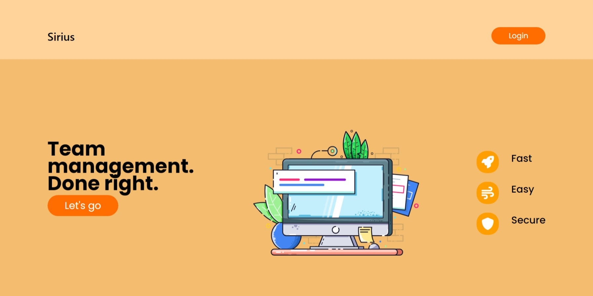

# Sirius



## Introduction
Many organizations have turned to Whatsapp to manage their day-to-day operations and it was especially prevalent during the pandemic. But the app isn't meant for this. All the important messages get buried under the spams and it is a headache to find the messages when required. The platform would be an alternative to using Whatsapp for administrative tasks and it will make management a breeze. The app is meant for managing the activities of student bodies in universities but it may be used by professional business organisations as well. 

## Description
Currently, the platform includes only a few modules such as daily timetable, an events calendar and a notice board with an extensive role based authoriztion system within teams. The user will be able to interact with an intuitive website to keep track of all the upcoming events and activities of the team he or she is a part of along with the schedule of their daily timetable. Users can start a completely new team or create teams within existing teams to create a hierarchy if they have the permission to do so. If permitted to do so by the admin, a user can create custom roles with select permissions and assign them to other members.

## Future
The future extensions for the project look promising and exciting and we plan on taking our project to open source fests to get help from our fellow developers. We are thinking of modules such as real-time chat, discussion threads, recruitment systems and much more.

## Tech Stack
### Backend
- Django
- SQLite3

### Frontend
- HTML
- Javascript
- Tailwind CSS
- Django Templating Language

## Plugins
- [TimelineJS](http://timetablejs.org/)
- [FullCalendar](https://fullcalendar.io/)

## Setting Up
- `cd` into `sirius`
- Setup a virtual environment
    ```cmd
    python -m venv venv
    ```
- Install `python` dependencies
    ```cmd
    pip install -r ./requirements.txt
    ```
- Install `tailwind` dependencies
    ```cmd
    cd theme/static_src
    npm install
    ```
- Specify `NPM_BIN_PATH` for your system in `sirius/settings.py`
- Run migrations
    ```cmd
    python manage.py makemigrations
    python manage.py migrate 
    ```

## Running
- Start the django server
    ```cmd
    python manage.py runserver
    ```
- Start the tailwind development server to detect changes and refresh the page
    ```cmd
    python manage.py tailwind start
    ```

## Links
- [Schema Diagram PDF](https://drive.google.com/file/d/163IhvRYj-V-m5IeCiI4JFjI8fJp7b8A4/view?usp=sharing)
- [DB Diagram Link](https://dbdiagram.io/d/6202471685022f4ee5583f54)
- [ERD]()
- [UI/UX](https://www.figma.com/file/UciXaJ17ccPkugIEhKTOWY/DBMS-Project?node-id=0%3A1)
